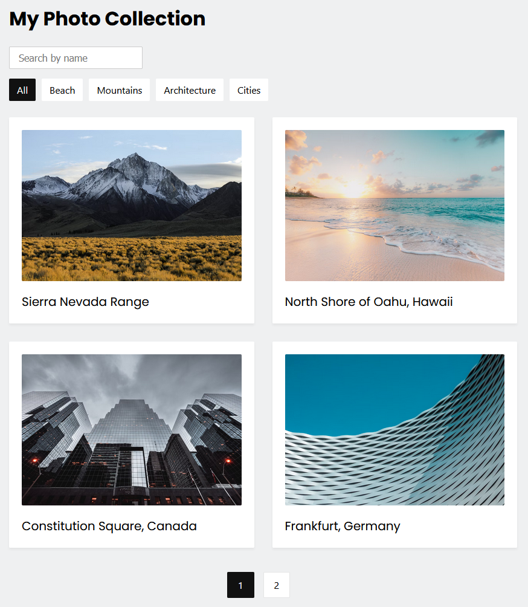

# My Photo Collection

A simple photo colleciton app using React.
 

> For the sake of simplicity and to focus on the frontend aspects of this project, I have opted to use a static data.json file as the data source rather than connecting to a live database. This approach provides a straightforward way to supply the application with data without the overhead of setting up and maintaining a backend and database connection. If you wish to integrate a database or any other data source, you'll need to modify the data fetching logic accordingly.
